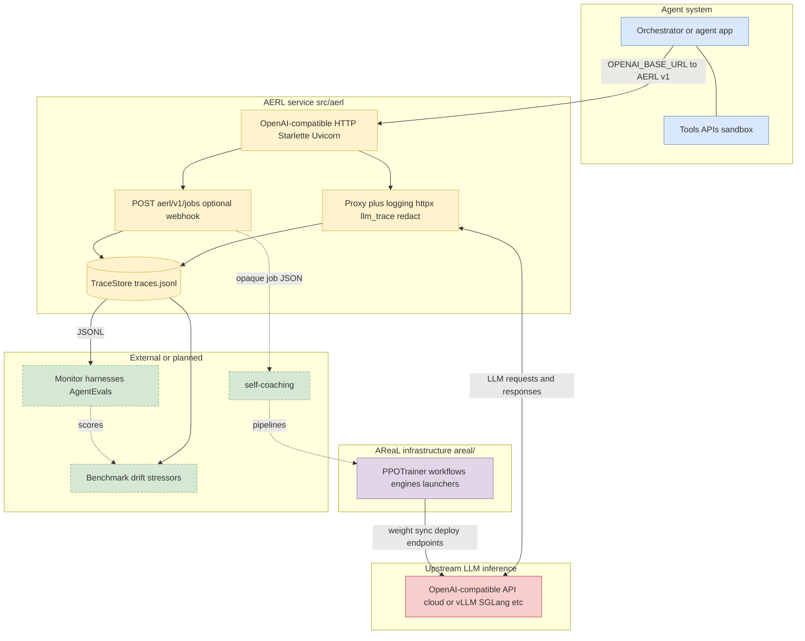

# AERL: Agent Self-Evaluation via Reinforcement Learning

AERL is the **ingestion and evidence** leg of a larger loop: capture **LLM chat and completion** traffic at a stable OpenAI-compatible boundary, feed **monitoring** and **benchmarks**, and hand off training and RL workloads to dedicated stacks. This repository keeps that boundary **small and deployable** so any agentic system can point at one `base_url` without re-wiring providers.

This monorepo also **vendors [AReaL](https://github.com/inclusionAI/AReaL)** under `areal/` as **AERL infrastructure** (engines, trainers, workflows)—import paths remain `areal.*` until a later consolidation phase.

**Implementation plan:** [docs/specs/2026-05-29-aerl-implementation-plan.md](docs/specs/2026-05-29-aerl-implementation-plan.md)

## Three in-repo components

| # | Component | CLI | Default port | Package |
|---|-----------|-----|--------------|---------|
| 1 | **Proxy** — OpenAI-compatible boundary + traces | `uv run aerl` | **8765** | `aerl.proxy` |
| 2 | **Infrastructure** — RL training stack | (scripts / launchers) | — | `areal/` (+ `customized_areal/`) |
| 3 | **Training service** — remote training runs | `uv run aerl-service` | **8766** | `aerl.service` |

```bash
export AERL_DATA_DIR=/tmp/aerl-data
export UPSTREAM_OPENAI_BASE_URL=https://api.openai.com/v1

uv run aerl          # proxy on :8765
uv run aerl-service  # training API on :8766
```

**Training API (MVP):**

- `GET /aerl/v1/training/pipelines` — list pipelines (`mock_grpo`, `gsm8k_grpo`)
- `POST /aerl/v1/training/runs` — start a run (`{"pipeline": "mock_grpo"}` for CI)
- `GET /aerl/v1/training/runs/{run_id}` — poll status

## Program plan (layers)

| Layer | What it does | Where it lives |
| ----- | ------------ | -------------- |
| **SERVICE** | Reverse proxy to your real provider under `/v1/*`, plus `/health`, `/ready`, and `POST /aerl/v1/jobs` for opaque orchestration payloads (optional webhook). | **`aerl.proxy`** (`src/aerl/proxy/`) |
| **MONITOR** | Score behavior over time from durable traces: replay, aggregate metrics, and run harnesses (for example **AgentEvals**) against the same traffic your agents generate. | Companion services or repos; AERL supplies **JSONL** and stable request IDs as the integration surface. |
| **BENCHMARK** | From logged or **drifted** traffic, build **harder or shifted evaluation sets** so headline scores reflect robustness, not a narrow prompt distribution. | Roadmap / separate pipelines (synthesis, governance, and review are not part of the minimal proxy). |
| **COACH** | Agent-led practice and training loops (skills, pipelines, runners) that consume traces, eval outcomes, or job signals. | Primarily [self-coaching](https://github.com/Miya-Liu/self-coaching), triggered outside this process. |
| **Infrastructure** | Core RL algorithm families and runtimes in asynchronous or synchronous styles (GRPO, PPO, agentic workflows, FSDP/Megatron/Archon backends). | **`areal/`** in this repository (from [inclusionAI/AReaL](https://github.com/inclusionAI/AReaL)); upstream docs remain the canonical reference. |

**Intended end-to-end flow:** agents and orchestrators call **SERVICE** → traces (and optional **jobs** / webhooks) feed **MONITOR** → **BENCHMARK** widens what you grade on under shift → **COACH** and **Infrastructure** turn signals into updated policies or weights → improved agents keep using the same **SERVICE** URL.

**What this repo implements today:**

- **SERVICE** — structured proxy and job logging to `{AERL_DATA_DIR}/traces.jsonl`, redaction and size caps (see [minimal core design](docs/specs/2026-05-13-aerl-minimal-core-design.md)).
- **Infrastructure** — the full **AReaL** training stack (`areal/`, `examples/`, `docs/`, `tests/`) for asynchronous RL on reasoning and agentic models.
- **Not in-repo (yet)** — hosted monitoring, benchmark synthesis, or AgentEvals runners; those consume JSONL traces or job webhooks from the SERVICE layer.

### System context

**Solid arrows** are HTTP or data paths this repository participates in; **dotted arrows** are integrations you wire separately (monitoring, coaching pipelines, external eval harnesses).

| Style | Meaning |
| ----- | ------- |
| Solid | **Agent LLM traffic** through AERL; **trace / job records** to disk; **AReaL training** against rollout engines. |
| Dotted | **Monitor**, **benchmark builders**, and **self-coaching** orchestration outside the minimal proxy. |



Point agents at AERL (`http://localhost:8765/v1`) during collection; point the same clients (or AReaL rollout workers) at training-serving endpoints after **Infrastructure** updates weights. See [OpenClaw example](./examples/openclaw/) for replacing `base_url` only.

## Repository layout

| Path | Role |
| ---- | ---- |
| `src/aerl/proxy/` | Component 1 — HTTP proxy, trace store, jobs |
| `src/aerl/service/` | Component 3 — training control API |
| `src/aerl/pipelines/` | Pipeline registry (`mock_grpo`, `gsm8k_grpo`) |
| `areal/` | Component 2 — RL infrastructure (fork of AReaL) |
| `customized_areal/` | AERL extensions (tree-search, TPFC; migrating later) |
| `examples/` | Training recipes (math, agentic RL, VLM, …) and AERL Docker compose |
| `docs/` | Jupyter Book docs (AReaL) and AERL specs under `docs/specs/` |
| `tests/` | Unit and integration tests for both stacks |

---

## AERL service

AERL proxy is a single-process **Starlette** app served by **Uvicorn** (`aerl.main:main` → `aerl.proxy.app.create_app()`). Settings load from the environment (`aerl.proxy.settings`).

**Request path**

- **Middleware** — `RequestIdMiddleware` (`src/aerl/middleware.py`) assigns `request.state.request_id` and echoes it as `X-AERL-Request-Id` on every response.
- **`/health`** / **`/ready`** — Small JSON handlers; `/ready` can optionally call the upstream via `probe_upstream` (`src/aerl/upstream_probe.py`).
- **`POST /aerl/v1/jobs`** — Validates JSON and size, appends a `job` event line to JSONL, and optionally POSTs the payload to a configured webhook (`src/aerl/jobs.py`).
- **`/v1/{path}`** — `proxy_v1` (`src/aerl/proxy.py`) forwards the request to `UPSTREAM_OPENAI_BASE_URL` with **httpx**, streams or buffers the body according to caps, passes response headers/body through, and writes one JSONL trace per call.

**Tracing and analytics**

- **TraceStore** (`src/aerl/trace_store.py`) — Thread-safe append to `{AERL_DATA_DIR}/traces.jsonl`.
- **llm_trace** (`src/aerl/llm_trace.py`) — Parses bodies for `user`, `model`, token `usage`, SSE aggregation, and optional USD estimates from `AERL_PRICING_JSON` (`src/aerl/pricing_config.py`).
- **redact** (`src/aerl/redact.py`) — Sanitizes logged request headers before persistence.
- **errors** (`src/aerl/errors.py`) — Consistent JSON error responses for client and upstream failures.


### Run the proxy

Requires Python 3.12+ (see `pyproject.toml`; the AERL-only path works without CUDA extras).

```bash
export UPSTREAM_OPENAI_BASE_URL=https://api.openai.com/v1
export AERL_DATA_DIR=/tmp/aerl-data
uv sync
uv run aerl
# or: python -m aerl
```

Listens on `AERL_LISTEN_HOST` / `AERL_LISTEN_PORT` (defaults `0.0.0.0:8765`). Traces append to `{AERL_DATA_DIR}/traces.jsonl`.

**Docker** (from repo root):

```bash
docker compose -f examples/docker-compose.yml up --build
```

Set `UPSTREAM_OPENAI_BASE_URL` in your shell or a `.env` file next to the compose file if you do not want the default.

### AERL environment

| Variable | Required | Default | Purpose |
| -------- | -------- | ------- | ------- |
| `UPSTREAM_OPENAI_BASE_URL` | yes | — | Upstream OpenAI-compatible API base (e.g. `https://api.openai.com/v1`). |
| `AERL_DATA_DIR` | yes | — | Writable directory for `traces.jsonl` and related data. |
| `AERL_LISTEN_HOST` | no | `0.0.0.0` | Bind address for Uvicorn. |
| `AERL_LISTEN_PORT` | no | `8765` | Bind port. |
| `AERL_MAX_BODY_BYTES` | no | `4194304` (4 MiB) | Max stored bytes per logged request/response body (and aggregated SSE text). |
| `AERL_MAX_BUFFERED_REQUEST_BYTES` | no | `33554432` (32 MiB) | Max client body buffered for logging; above this, bodies stream without log retention. |
| `AERL_UPSTREAM_TIMEOUT` | no | `120.0` | Seconds for proxied `/v1/*` upstream HTTP calls. |
| `AERL_READY_CHECK_UPSTREAM` | no | off | If `true` / `1` / `yes`, `GET /ready` probes the upstream. |
| `AERL_READY_PROBE_PATH` | no | `models` | Path segment after `UPSTREAM_OPENAI_BASE_URL` for the readiness probe. |
| `AERL_READY_AUTH` | no | — | Optional `Authorization` for the readiness probe only. |
| `AERL_JOB_WEBHOOK_URL` | no | — | If set, accepted jobs are POSTed here as JSON. |
| `AERL_JOB_WEBHOOK_AUTH` | no | — | Optional `Authorization` header for the job webhook. |
| `AERL_JOB_WEBHOOK_TIMEOUT` | no | `30.0` | Seconds for the job webhook HTTP client. |
| `AERL_MAX_JOB_BYTES` | no | `1048576` (1 MiB) | Max JSON body size for `POST /aerl/v1/jobs`. |
| `AERL_PRICING_JSON` | no | — | Path to a JSON file for estimated USD cost (see below). |

### AERL endpoints

- `GET /health` — liveness JSON with version.
- `GET /ready` — readiness; optional upstream probe when `AERL_READY_CHECK_UPSTREAM` is enabled.
- `POST /aerl/v1/jobs` — opaque JSON job envelope (max `AERL_MAX_JOB_BYTES`); optional webhook forwarding; returns `{ "job_id", "status" }`.
- `GET/POST/PUT/PATCH/DELETE/OPTIONS /v1/{path}` — reverse proxy to `{UPSTREAM_OPENAI_BASE_URL}/{path}`; responses pass through unchanged; `X-AERL-Request-Id` is added.

#### Proxy logging (v1)

JSONL records include redacted request headers (see spec §7). Non-stream responses log truncated bodies when over the byte cap. **SSE** (`Content-Type: text/event-stream`): the same SSE bytes are returned to the client; traces store **`stream: true`**, **`aggregated_text`** (concatenated `choices[0].delta.content` from `data:` JSON lines), and **`aggregated_text_truncated`** when over the cap — raw SSE lines are not persisted in full.

**Service metrics (every proxied `/v1/*` record):**

- **`latency_ms_total`** — wall timing from handler entry until the full upstream response is available (milliseconds).
- **`latency_ms_upstream`** — time spent on the upstream HTTP call only.
- **`stream`** — `true` for SSE (`text/event-stream` on HTTP 200), otherwise `false`.
- **`openai_user`** — when the JSON request body includes OpenAI’s optional `user` string.
- **`caller_label`** — first non-empty of `X-AERL-User`, `X-User-Id`, or `X-Request-User`.
- **`usage`** — normalized `prompt_tokens`, `completion_tokens`, `total_tokens` plus raw upstream usage when present.
- **`cost_usd_estimated`** — when `AERL_PRICING_JSON` is set and token counts are present (estimate only).

**`AERL_PRICING_JSON` format** (see `examples/aerl-pricing.example.json`):

```json
{
  "default": { "input_per_million_usd": 5.0, "output_per_million_usd": 15.0 },
  "per_model": {
    "gpt-4o-mini": { "input_per_million_usd": 0.15, "output_per_million_usd": 0.60 }
  }
}
```

Per-model rates override `default`; if neither matches the request `model`, `default` is used when present.

---

## AReaL infrastructure

[AReaL](https://github.com/inclusionAI/AReaL) is an open-source **fully asynchronous** reinforcement learning training system for large **reasoning and agentic models**, developed by Tsinghua IIIS and the AReaL Team at Ant Group (built on [ReaLHF](https://github.com/openpsi-project/ReaLHF)).

**Highlights**

- **Flexibility** — [agentic RL](https://inclusionai.github.io/AReaL/en/tutorial/agentic_rl.html) and [online RL](./examples/openclaw/) by replacing `base_url`.
- **Scalability** — stable fully asynchronous RL with industry-leading throughput.
- **Performance** — state-of-the-art math, coding, search, and customer-service agents (see upstream [docs](https://inclusionai.github.io/AReaL/) and [paper](https://arxiv.org/pdf/2505.24298)).

| | |
| --- | --- |
| **Paper** | [arxiv:2505.24298](https://arxiv.org/pdf/2505.24298) |
| **Documentation** | [inclusionai.github.io/AReaL](https://inclusionai.github.io/AReaL/) |
| **中文文档** | [AReaL zh](https://inclusionai.github.io/AReaL/zh/) |

### Getting started (RL training)

Requires Python 3.12+, Linux x86_64 with CUDA for `--extra cuda`.

```bash
git clone <this-repo>
cd AERL
pip install uv
# Optional: pre-built flash-attn wheel to avoid compiling from source
# https://github.com/mjun0812/flash-attention-prebuild-wheels/releases
uv sync --extra cuda   # training packages + SGLang (default inference backend)
# For vLLM: cp pyproject.vllm.toml pyproject.toml && cp uv.vllm.lock uv.lock && uv sync --extra cuda
```

Single-node GSM8K GRPO (downloads dataset and Qwen2-1.5B-Instruct automatically):

```bash
python3 examples/math/gsm8k_rl.py --config examples/math/gsm8k_grpo.yaml scheduler.type=local
```

Ray cluster (2 nodes × 8 GPUs — update paths in the YAML for shared storage):

```bash
python3 examples/math/gsm8k_rl.py --config examples/math/gsm8k_grpo.yaml \
  cluster.n_nodes=2 cluster.n_gpus_per_node=8 \
  scheduler.type=ray
```

Full setup: [AReaL quickstart](https://inclusionai.github.io/AReaL/en/tutorial/quickstart.html).

### Examples

| Area | Entry points |
| ---- | ------------ |
| **Math & reasoning** | [examples/math/](examples/math/) (GRPO, PPO, DAPO, …), [multi_turn_math/](examples/multi_turn_math/), [countdown/](examples/countdown/) |
| **Agentic RL** | [agent_workflow/](examples/agent_workflow/), [tau2/](examples/tau2/), [search_agent/](examples/search_agent/), [tir/](examples/tir/), [openclaw/](examples/openclaw/) |
| **Vision-language** | [vlm/](examples/vlm/), [vlm_npu/](examples/vlm_npu/) |
| **Alignment & ops** | [alignment/](examples/alignment/), [skypilot/](examples/skypilot/) |

### Support matrix (summary)

All listed RL algorithms support synchronous training via `max_head_offpolicyness=0`. Details: [async RL guide](docs/en/algorithms/async.md).

| Backend | Training | Inference partners |
| ------- | -------- | ------------------ |
| **Megatron** | ZeRO-1 DP, TP, PP, CP, EP | vLLM (LoRA) |
| **PyTorch FSDP** | FSDP2, TP, CP | SGLang, vLLM |
| **PyTorch Archon** | FSDP2, MoE PP/EP | SGLang |

Model families (Qwen2/3, Qwen3-MoE, Qwen VL, Gemma 3, …): see the full table in upstream [AReaL README](https://github.com/inclusionAI/AReaL/blob/main/README.md#-support-matrix) or [Archon tutorial](docs/en/tutorial/archon.md).

### AReaL resources

- [Installation](docs/en/tutorial/installation.md) · [Quickstart](docs/en/tutorial/quickstart.md) · [Agentic RL](docs/en/tutorial/agentic_rl.md)
- [GRPO on GSM8K walkthrough](docs/en/tutorial/gsm8k_grpo.md)
- [CLI reference](docs/en/cli_reference.md) · [Contributing](CONTRIBUTING.md) · [Roadmap](ROADMAP.md)

---

## Development

**AERL proxy tests** (no GPU):

```bash
uv sync --extra dev
uv run pytest tests/test_proxy.py tests/test_jobs.py -q
```

**AReaL suite** (many tests need GPU / multi-GPU):

```bash
uv sync --extra cuda --group dev
pre-commit install --install-hooks
uv run pytest tests/test_<topic>.py
```

See [AGENTS.md](AGENTS.md) for agent-oriented conventions.

## Integration

- **Trace collection** — point any OpenAI-compatible client at AERL (`http://localhost:8765/v1`); set `UPSTREAM_OPENAI_BASE_URL` to your real provider.
- **Self-coaching** — [self-coaching](https://github.com/Miya-Liu/self-coaching) can use the same `service.url` / `OPENAI_BASE_URL` pattern.
- **Online / agentic RL** — AReaL rollout workers accept a configurable inference `base_url`; use AERL during data collection and switch to training-serving endpoints after weight updates ([OpenClaw example](./examples/openclaw/)).

### Local mock upstream (optional)

```bash
uv run uvicorn examples.mock_upstream:app --host 127.0.0.1 --port 9999
UPSTREAM_OPENAI_BASE_URL=http://127.0.0.1:9999/v1 AERL_DATA_DIR=/tmp/aerl-data uv run aerl
```

## Acknowledgments

We are grateful to the [AReaL](https://github.com/inclusionAI/AReaL) team at Tsinghua IIIS and Ant Group for open-sourcing a production-grade asynchronous RL stack. The `areal/` code in this repository is derived from their work; we reuse it with appreciation and recommend citing [Fu et al., 2025](https://arxiv.org/abs/2505.24298) when you build on the training infrastructure here.
