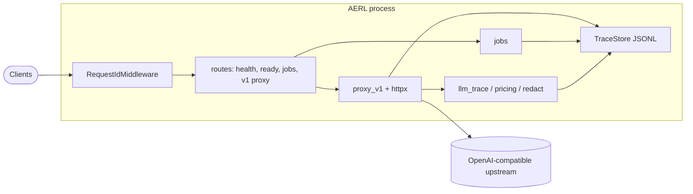

# AERL: Agent Self-Evaluation via Reinforcement Learning

AERL is the **ingestion and evidence** leg of a larger loop: capture **LLM chat and completion** traffic at a stable OpenAI-compatible boundary, feed **monitoring** and **benchmarks**, and hand off training and RL workloads to dedicated stacks. This repository intentionally keeps that boundary **small and deployable** so any agentic system can point at one `base_url` without re-wiring providers.

## Program plan (layers)

| Layer | What it does | Where it lives |
| ----- | ------------ | -------------- |
| **SERVICE** | Reverse proxy to your real provider under `/v1/*`, plus `/health`, `/ready`, and `POST /aerl/v1/jobs` for opaque orchestration payloads (optional webhook). | **This repository** (`src/aerl/`). |
| **MONITOR** | Score behavior over time from durable traces: replay, aggregate metrics, and run harnesses (for example **AgentEvals**) against the same traffic your agents generate. | Companion services or repos; AERL supplies **JSONL** and stable request IDs as the integration surface. |
| **BENCHMARK** | From logged or **drifted** traffic, build **harder or shifted evaluation sets** so headline scores reflect robustness, not a narrow prompt distribution. | Roadmap / separate pipelines (synthesis, governance, and review are not part of the minimal proxy). |
| **COACH** | Agent-led practice and training loops (skills, pipelines, runners) that consume traces, eval outcomes, or job signals. | Primarily [self-coaching](https://github.com/Miya-Liu/self-coaching), triggered outside this process. |
| **Infrastructure** | Core RL algorithm families and runtimes in asynchronous or synchronous styles (for example AReaL, VREL, TFRL). | Upstream training frameworks; **explicitly out of scope** for the minimal HTTP core. |

**Intended end-to-end flow:** agents and orchestrators call **SERVICE** → traces (and optional **jobs** / webhooks) feed **MONITOR** → **BENCHMARK** widens what you grade on under shift → **COACH** and **Infrastructure** turn signals into updated policies or weights → improved agents keep using the same **SERVICE** URL.

**What this repo implements today:** the **SERVICE** layer, structured **proxy and job logging** to `{AERL_DATA_DIR}/traces.jsonl`, redaction and size caps as documented below. It does **not** ship RL training, distributed queues, benchmark synthesis, or AgentEvals themselves; those remain adjacent systems bound by your trace schema and ops. Non-goals for v1 are listed in the [minimal core design](docs/specs/2026-05-13-aerl-minimal-core-design.md).

## Architecture

AERL is a single-process **Starlette** app served by **Uvicorn** (`aerl.main:main` → `create_app()` in `src/aerl/app.py`). One `Settings` object is loaded from the environment (`src/aerl/settings.py`) and attached to `app.state` for handlers.

**Request path**

- **Middleware** — `RequestIdMiddleware` (`src/aerl/middleware.py`) assigns `request.state.request_id` and echoes it as `X-AERL-Request-Id` on every response.
- **`/health`** / **`/ready`** — Small JSON handlers; `/ready` can optionally call the upstream via `probe_upstream` (`src/aerl/upstream_probe.py`).
- **`POST /aerl/v1/jobs`** — Validates JSON and size, appends a `job` event line to JSONL, and optionally POSTs the payload to a configured webhook (`src/aerl/jobs.py`).
- **`/v1/{path}`** — `proxy_v1` (`src/aerl/proxy.py`) forwards the request to `UPSTREAM_OPENAI_BASE_URL` with **httpx**, streams or buffers the body according to caps, passes response headers/body through, and writes one JSONL trace per call.

**Tracing and analytics**

- **TraceStore** (`src/aerl/trace_store.py`) — Thread-safe append to `{AERL_DATA_DIR}/traces.jsonl`.
- **llm_trace** (`src/aerl/llm_trace.py`) — Parses bodies for `user`, `model`, token `usage`, SSE aggregation, and optional USD estimates from `AERL_PRICING_JSON` (`src/aerl/pricing_config.py`).
- **redact** (`src/aerl/redact.py`) — Sanitizes logged request headers before persistence.
- **errors** (`src/aerl/errors.py`) — Consistent JSON error responses for client and upstream failures.



## Run

Requires Python 3.11+.

```bash
export UPSTREAM_OPENAI_BASE_URL=https://api.openai.com/v1   # or your OpenAI-compatible base (no trailing slash except for bare root)
export AERL_DATA_DIR=/tmp/aerl-data
uv sync
uv run aerl
# or: python -m aerl
```

Listens on `AERL_LISTEN_HOST` / `AERL_LISTEN_PORT` (defaults `0.0.0.0:8765`). Traces append to `{AERL_DATA_DIR}/traces.jsonl`.

### Example Docker

From the repo root:

```bash
docker compose -f examples/docker-compose.yml up --build
```

Set `UPSTREAM_OPENAI_BASE_URL` in your shell or a `.env` file next to the compose file if you do not want the default.

## Environment


| Variable                          | Required | Default             | Purpose                                                                                                                                            |
| --------------------------------- | -------- | ------------------- | -------------------------------------------------------------------------------------------------------------------------------------------------- |
| `UPSTREAM_OPENAI_BASE_URL`        | yes      | —                   | Upstream OpenAI-compatible API base (e.g. `https://api.openai.com/v1`).                                                                            |
| `AERL_DATA_DIR`                   | yes      | —                   | Writable directory for `traces.jsonl` and related data.                                                                                            |
| `AERL_LISTEN_HOST`                | no       | `0.0.0.0`           | Bind address for Uvicorn.                                                                                                                          |
| `AERL_LISTEN_PORT`                | no       | `8765`              | Bind port.                                                                                                                                         |
| `AERL_MAX_BODY_BYTES`             | no       | `4194304` (4 MiB)   | Max stored bytes per logged request/response body (and aggregated SSE text); larger payloads are truncated in logs.                                |
| `AERL_MAX_BUFFERED_REQUEST_BYTES` | no       | `33554432` (32 MiB) | Max client body AERL buffers for logging and forwarding; above this, bodies are streamed without being retained for logs (`request_body_omitted`). |
| `AERL_UPSTREAM_TIMEOUT`           | no       | `120.0`             | Seconds for proxied `/v1/*` upstream HTTP calls.                                                                                                   |
| `AERL_READY_CHECK_UPSTREAM`       | no       | off                 | If `true` / `1` / `yes`, `GET /ready` probes the upstream.                                                                                         |
| `AERL_READY_PROBE_PATH`           | no       | `models`            | Path segment joined after `UPSTREAM_OPENAI_BASE_URL` for the readiness probe (e.g. `…/v1/models`).                                                 |
| `AERL_READY_AUTH`                 | no       | —                   | Optional `Authorization` value for the readiness probe only.                                                                                       |
| `AERL_JOB_WEBHOOK_URL`            | no       | —                   | If set, accepted jobs are POSTed here as JSON.                                                                                                     |
| `AERL_JOB_WEBHOOK_AUTH`           | no       | —                   | Optional `Authorization` header for the job webhook.                                                                                               |
| `AERL_JOB_WEBHOOK_TIMEOUT`        | no       | `30.0`              | Seconds for the job webhook HTTP client.                                                                                                           |
| `AERL_MAX_JOB_BYTES`              | no       | `1048576` (1 MiB)   | Max JSON body size for `POST /aerl/v1/jobs`.                                                                                                       |
| `AERL_PRICING_JSON`               | no       | —                   | Path to a JSON file for **estimated** USD cost (see below). If unset, traces omit `cost_usd_estimated`.                                            |


## Endpoints

- `GET /health` — liveness JSON with version.
- `GET /ready` — readiness; optional upstream probe when `AERL_READY_CHECK_UPSTREAM` is enabled.
- `POST /aerl/v1/jobs` — opaque JSON job envelope (max `AERL_MAX_JOB_BYTES`); optional webhook forwarding; returns `{ "job_id", "status" }`.
- `GET/POST/PUT/PATCH/DELETE/OPTIONS /v1/{path}` — reverse proxy to `{UPSTREAM_OPENAI_BASE_URL}/{path}`; responses pass through unchanged; `X-AERL-Request-Id` is added.

### Proxy logging (v1)

JSONL records include redacted request headers (see spec §7). Non-stream responses log truncated bodies when over the byte cap. **SSE** (`Content-Type: text/event-stream`): the same SSE bytes are returned to the client; traces store `**stream: true`**, `**aggregated_text`** (concatenated `choices[0].delta.content` from `data:` JSON lines), and `**aggregated_text_truncated**` when over the cap — raw SSE lines are not persisted in full.

**Service metrics (every proxied `/v1/*` record):**

- `**latency_ms_total`** — wall timing from handler entry until the full upstream response is available (milliseconds, `perf_counter`).
- `**latency_ms_upstream`** — time spent on the upstream HTTP call only (send through response complete).
- `**stream`** — `true` for SSE (`text/event-stream` on HTTP 200), otherwise `false`.
- `**openai_user**` — when the JSON request body includes OpenAI’s optional `user` string, it is copied for tenancy / stable-id analytics.
- `**caller_label**` — first non-empty of `X-AERL-User`, `X-User-Id`, or `X-Request-User` (orchestrator identity; not the bearer token).
- `**usage**` — when the upstream JSON (non-stream) or SSE `data:` lines include a `usage` object with token counts, AERL logs normalized `prompt_tokens`, `completion_tokens`, `total_tokens` plus the raw `**upstream**` usage dict.
- `**cost_usd_estimated**` — only when `AERL_PRICING_JSON` is set **and** both prompt and completion token counts are present: `(prompt_tokens / 1e6) * input_per_million_usd + (completion_tokens / 1e6) * output_per_million_usd` using rates from the pricing file. This is an **estimate** (your provider invoice is authoritative).

`**AERL_PRICING_JSON` format** (see `examples/aerl-pricing.example.json`):

```json
{
  "default": { "input_per_million_usd": 5.0, "output_per_million_usd": 15.0 },
  "per_model": {
    "gpt-4o-mini": { "input_per_million_usd": 0.15, "output_per_million_usd": 0.60 }
  }
}
```

Per-model rates override `default`; if neither matches the request `model`, `default` is used when present.

## Development

```bash
uv sync --extra dev
uv run pytest -q
```

(Or `python -m venv .venv && pip install -e '.[dev]'` then `pytest`.)

## Integration

For self-coaching or similar stacks that expect an OpenAI-compatible base URL, point clients at AERL (e.g. `http://localhost:8765/v1`) and configure the upstream with `UPSTREAM_OPENAI_BASE_URL`. See [self-coaching](https://github.com/Miya-Liu/self-coaching) for how your runner may set `service.url` / `OPENAI_BASE_URL`.

## Local mock upstream (optional)

```bash
uv run uvicorn examples.mock_upstream:app --host 127.0.0.1 --port 9999
UPSTREAM_OPENAI_BASE_URL=http://127.0.0.1:9999/v1 AERL_DATA_DIR=/tmp/aerl-data uv run aerl
```

