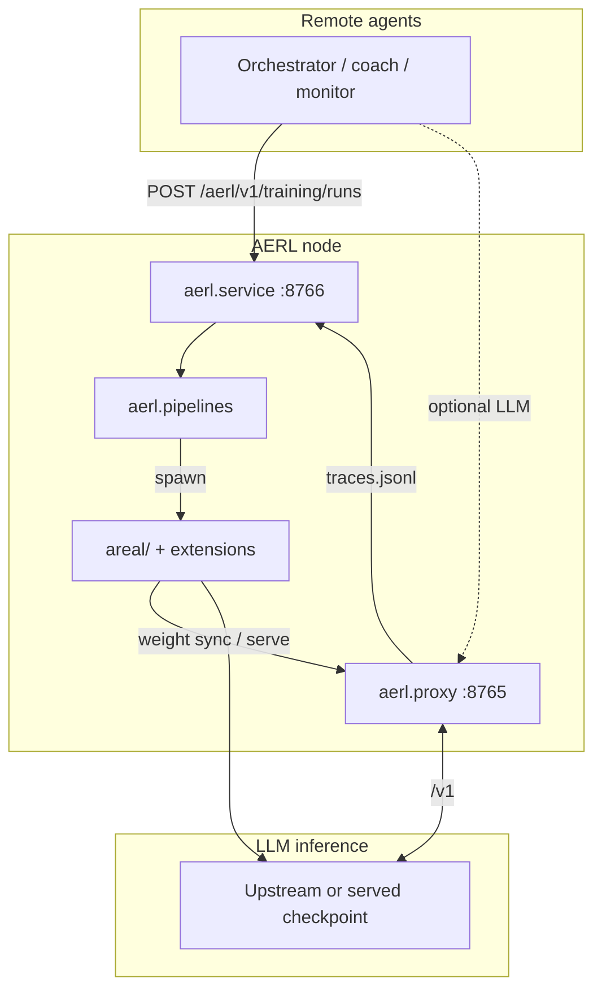

# AERL — Three-component implementation plan

**Status:** In progress (Phases 0–2 landed 2026-05-29)  
**Date:** 2026-05-29  
**Supersedes / extends:** [minimal core design (2026-05-13)](2026-05-13-aerl-minimal-core-design.md) — proxy scope unchanged; this plan adds Components 2–3 and repository structure.

---

## 1. Executive summary

AERL is a **local training node** composed of three deployable components in one repository:

| # | Component | Purpose |
|---|-----------|---------|
| **1** | **Proxy** | OpenAI-compatible HTTP boundary, trace logging, legacy job hook |
| **2** | **Infrastructure** | Distributed RL training (engines, trainers, workflows, launchers) — vendored from GitLab/AReaL |
| **3** | **Training service** | Accept remote training intent, register pipelines, launch and track runs on Infrastructure |

**Final vision:** A long-running **local agent** that offers LLM training services and listens to **remote agents** for objectives (target metric, model, trainer, data, pipeline overrides). MONITOR, BENCHMARK, and COACH remain **external clients** of this repo—not in-tree products.

**Naming:** Public surfaces use **AERL**; the Python package is **`aerl`**. Code may import **`areal.*`** only inside the infrastructure layer (fork of [inclusionAI/AReaL](https://github.com/inclusionAI/AReaL)).

---

## 2. Decisions locked (2026-05-29)

### 2.1 Repository layout

```text
src/aerl/
  proxy/              # Component 1 (canonical OpenAI boundary)
  service/            # Component 3 (training control plane)
  pipelines/          # Pipeline registry + runners (gsm8k_grpo, mock_grpo)
  main.py             # CLI: aerl
  service_main.py     # CLI: aerl-service

areal/                # Component 2 — at repo root; do not move in Phase 0–2
customized_areal/     # GitLab extensions → migrate to aerl/extensions/ in Phase 3+

examples/             # Pipeline configs and entry scripts (e.g. gsm8k_grpo)
docs/specs/           # Design and plans (this file)
tests/                # Proxy tests + service tests + existing areal tests
```

- **Do not** use `src/proxy` as a top-level package (breaks unified `aerl` install).
- **Do not** add `src/infra` until a dedicated rename/migration phase for `areal/`.

### 2.2 Canonical proxy

| Path | Role |
|------|------|
| `aerl.proxy` | **Only supported** OpenAI boundary for agents and trace collection |
| `areal/experimental/openai/proxy/` | **Internal / legacy** — no new features; eventual thin wrapper or removal |

### 2.3 Ports (defaults)

| Process | Env var | Default | Avoid |
|---------|---------|---------|--------|
| Proxy | `AERL_LISTEN_PORT` | **8765** | 8000, 8080, 8888, 11434, … |
| Training service | `AERL_SERVICE_PORT` | **8766** | Same; optional dev override `18766` |

Two processes on one host: `aerl` (proxy) and `aerl-service` (control plane).

### 2.4 MVP pipelines

| Pipeline ID | Purpose | Entry |
|-------------|---------|--------|
| **`gsm8k_grpo`** | Real GRPO training (MVP) | `examples/math/gsm8k_rl.py` + `examples/math/gsm8k_grpo.yaml` |
| **`mock_grpo`** | Service/CI integration without GPU | New runner under `aerl/pipelines/` |

---

## 3. Current state (post–GitLab merge)

### 3.1 What exists

| Area | Location | Maturity |
|------|----------|----------|
| Proxy v1 | `src/aerl/*.py` (flat) | Shippable; tests in `tests/test_proxy*.py` |
| Infrastructure | `areal/` (~401 modules) | Full AReaL stack |
| Extensions | `customized_areal/` (tree-search, TPFC, …) | Active; import/test drift after reorg |
| GRPO example | `examples/math/gsm8k_rl.py` | Production path; needs GPU + inference backend |
| Training service | — | **Missing** (CLI scripts only) |
| Opaque jobs | `POST /aerl/v1/jobs` | Implemented; not typed for training |

### 3.2 Known issues (address in plan)

| ID | Issue | Phase |
|----|-------|-------|
| I1 | Public docs say AERL; `pyproject` metadata still references AReaL upstream URLs | 0 |
| I2 | `customized_areal` parallel tree + `sys.path` hacks | 3 |
| I3 | Duplicate proxy (`areal/experimental/openai/proxy`) | 0–1 |
| I4 | Tests import `customized_areal.tree_search.mcts_tree_store` after move to `core/tree_store` | 0 |
| I5 | No bridge: remote intent → training run | 1–2 |
| I6 | `main` 314 commits ahead of `origin/main` | Ops (out of code plan) |

### 3.3 Out of repo scope

- Hosted MONITOR / BENCHMARK / AgentEvals runners
- COACH (e.g. self-coaching) as embedded product
- Full rename `areal` → `aerl` package (deferred; high merge cost with upstream)

---

## 4. Target architecture



### 4.1 Component boundaries

**Component 1 — Proxy (`aerl.proxy`)**

- Responsibilities: `/health`, `/ready`, `/v1/*`, `POST /aerl/v1/jobs` (legacy), trace store.
- Non-responsibilities: training loops, weight sync, pipeline registry.
- Future: `AERL_PROXY_MODE=trace|serve` to route `/v1` to local checkpoint (Phase 4).

**Component 2 — Infrastructure (`areal/` + extensions)**

- Responsibilities: `PPOTrainer`, `GRPOConfig`, engines (FSDP/Megatron/Archon), workflows, launchers, `areal/experimental/training_service` (gateway/router/worker for **serving weights during training** — not pipeline orchestration).
- Consumed by: pipeline entry scripts and subprocesses spawned by Component 3.
- Provenance: document as fork of AReaL; keep `areal` import path until explicit migration.

**Component 3 — Training service (`aerl.service`)**

- Responsibilities: typed training API, run lifecycle, pipeline registry, subprocess supervisor, status/events.
- Non-responsibilities: implementing GRPO math (delegates to Infrastructure).

---

## 5. HTTP API (Component 3)

Base URL: `http://<host>:${AERL_SERVICE_PORT}` (default **8766**).

Namespace: `/aerl/v1/training/*` (distinct from proxy `/aerl/v1/jobs`).

### 5.1 Create run

`POST /aerl/v1/training/runs`

```json
{
  "run_id": "optional-client-id",
  "pipeline": "gsm8k_grpo",
  "objective": {
    "type": "maximize_reward",
    "metric": "gsm8k_accuracy"
  },
  "model": {
    "base": "Qwen/Qwen2.5-0.5B-Instruct"
  },
  "trainer": {
    "kind": "PPOTrainer",
    "algorithm": "grpo"
  },
  "data": {
    "dataset": "gsm8k",
    "split": "train"
  },
  "overrides": {
    "total_train_epochs": 1,
    "experiment_name": "remote-run-001"
  },
  "signals": {
    "trace_request_id": null,
    "priority": "normal"
  }
}
```

Response: `202 Accepted`

```json
{
  "run_id": "uuid",
  "status": "accepted",
  "pipeline": "gsm8k_grpo"
}
```

### 5.2 Poll status

`GET /aerl/v1/training/runs/{run_id}`

```json
{
  "run_id": "uuid",
  "status": "running",
  "pipeline": "gsm8k_grpo",
  "created_at": "ISO-8601",
  "updated_at": "ISO-8601",
  "config_path": "/data/aerl/runs/uuid/config.yaml",
  "log_path": "/data/aerl/runs/uuid/train.log",
  "exit_code": null,
  "error": null
}
```

**Status enum:** `accepted` → `validating` → `queued` → `provisioning` → `running` → `completed` | `failed` | `cancelled`

### 5.3 List pipelines

`GET /aerl/v1/training/pipelines`

Returns registered pipeline metadata (id, description, `requires_gpu`, default config path).

### 5.4 Phase 2+ endpoints

- `POST /aerl/v1/training/runs/{run_id}/cancel`
- `GET /aerl/v1/training/runs/{run_id}/events` (SSE)
- `PATCH /aerl/v1/training/runs/{run_id}` (override hyperparameters — later)

### 5.5 Auth (Phase 3)

- Optional `Authorization: Bearer <AERL_SERVICE_TOKEN>` on service only.
- Proxy unchanged (upstream keys on client requests).

---

## 6. Pipeline registry

### 6.1 Manifest format

YAML under `aerl/pipelines/manifests/<id>.yaml`:

```yaml
id: gsm8k_grpo
description: GSM8K GRPO via AERL infrastructure (PPOTrainer + RLVRWorkflow)
entrypoint: examples/math/gsm8k_rl.py
default_config: examples/math/gsm8k_grpo.yaml
requires_gpu: true
requires_inference: true
timeout_seconds: 86400
```

```yaml
id: mock_grpo
description: Fake GRPO run for service integration tests (no GPU)
runner: aerl.pipelines.mock_grpo:run
requires_gpu: false
requires_inference: false
timeout_seconds: 120
```

### 6.2 Run directory layout

```text
${AERL_DATA_DIR}/
  traces.jsonl
  runs/
    {run_id}/
      request.json          # original POST body
      config.yaml           # merged config
      train.log             # subprocess stdout/stderr
      status.json           # lifecycle state
      train_id.json         # optional, when infra writes it
```

### 6.3 Supervisor behavior

1. Validate `pipeline` against registry.
2. Merge `overrides` into default config (shallow dict merge for v1; YAML path overrides later).
3. Write `config.yaml` and `status.json`.
4. Spawn: `uv run python <entrypoint> --config <config.yaml>` (or in-process runner for `mock_grpo`).
5. Poll subprocess; update `status.json`; on exit set `completed` or `failed`.

---

## 7. Implementation phases

### Phase 0 — Stabilize & document (≈1 week)

**Goals:** Clear narrative, green proxy tests, no new features in legacy proxy.

| Task | Deliverable |
|------|-------------|
| Add this plan + link from README | `docs/specs/2026-05-29-aerl-implementation-plan.md` |
| README: three components, ports, naming policy | Updated `README.md` |
| Mark legacy proxy | `areal/experimental/openai/proxy/README.md` (internal only) |
| Fix extension test imports | Re-export shims or update imports to `core.tree_store` |
| `pyproject` metadata | Description/homepage → AERL repo; footnote AReaL provenance |
| CI smoke | `pytest tests/test_proxy*.py tests/test_jobs.py -q` |

**Exit criteria:** Proxy tests pass; README matches three-component model; issue I3/I4 documented or fixed.

---

### Phase 1 — Package refactor (≈1–2 weeks)

**Goals:** `src/aerl/proxy/` submodule without behavior change.

| Task | Deliverable |
|------|-------------|
| Move `src/aerl/{app,proxy,jobs,...}.py` → `src/aerl/proxy/` | Same HTTP behavior |
| Update imports, `pyproject` `source-include`, tests | `from aerl.proxy.app import create_app` |
| Keep CLI `aerl = aerl.main:main` | Thin `main.py` delegates to proxy |
| Deprecation shim (optional) | `aerl.app` re-exports with `DeprecationWarning` for one release |

**Exit criteria:** All existing proxy tests pass; `uv run aerl` unchanged for users.

---

### Phase 2 — Training service MVP (≈2–3 weeks)

**Goals:** Runnable `aerl-service` with `mock_grpo` and `gsm8k_grpo` registration.

| Task | Deliverable |
|------|-------------|
| `aerl/service/settings.py` | `AERL_SERVICE_PORT`, `AERL_DATA_DIR`, token optional |
| `aerl/service/app.py` | Starlette/FastAPI app |
| `aerl/service/runs.py` | POST/GET runs, filesystem run store |
| `aerl/service/supervisor.py` | Subprocess spawn + status updates |
| `aerl/pipelines/registry.py` | Load manifests |
| `aerl/pipelines/mock_grpo.py` | Sleep, write fake artifacts, exit 0 |
| Manifests | `gsm8k_grpo.yaml`, `mock_grpo.yaml` |
| CLI | `aerl-service = aerl.service_main:main` |
| Tests | `tests/test_service_runs.py` using `mock_grpo` only |

**Exit criteria:**

- `curl -X POST localhost:8766/aerl/v1/training/runs -d '{"pipeline":"mock_grpo"}'` → completes.
- `gsm8k_grpo` registered; manual spawn works on GPU machine (documented, not CI-gated).

---

### Phase 3 — Remote agent contract (≈2 weeks)

**Goals:** Stable schema and observability for external orchestrators.

| Task | Deliverable |
|------|-------------|
| JSON Schema or Pydantic models for request/response | `aerl/service/schemas.py` |
| `GET /aerl/v1/training/pipelines` | Discovery |
| `GET .../events` (SSE) | `status`, `log` tail events |
| `POST .../cancel` | SIGTERM subprocess |
| Optional `AERL_SERVICE_TOKEN` | 401 on mismatch |
| Docker compose service | `aerl-service` alongside `aerl` in `examples/docker-compose.yml` |

**Exit criteria:** Remote agent can submit, poll, stream events, cancel `mock_grpo` without SSH.

---

### Phase 4 — Infrastructure integration (≈3–4 weeks)

**Goals:** Reliable real GRPO runs from service; begin extension consolidation.

| Task | Deliverable |
|------|-------------|
| Pre-flight checks for `gsm8k_grpo` | GPU count, config paths, fileroot writable |
| Launcher integration | Optional: call `areal/infra/launcher` instead of raw subprocess |
| Merge config overrides | CLI-style `key=value` from `overrides` dict |
| Fix `customized_areal` test imports | Phase 0 carryover if needed |
| Trace signal (optional) | `signals.trace_request_id` → note in run metadata |
| Document `training_service` vs Component 3 | README table |

**Exit criteria:** One end-to-end `gsm8k_grpo` run started via API on a GPU dev box (documented recipe).

---

### Phase 5 — Extensions & proxy serve mode (ongoing)

| Task | Deliverable |
|------|-------------|
| `customized_areal` → `aerl/extensions/` | Shims, single package |
| Register `tpfc_tree_search` pipeline | Second real pipeline |
| `AERL_PROXY_MODE=serve` | Route `/v1` to local inference endpoint post-training |
| K8s/Slurm recipes | Deployment docs |

---

## 8. Testing strategy

| Layer | Tests | Hardware |
|-------|-------|----------|
| Proxy | Existing `tests/test_proxy*.py`, `test_jobs.py` | None |
| Service + mock | `tests/test_service_*.py` | None |
| Pipeline registry | Unit: manifest load, merge overrides | None |
| GRPO e2e | Existing `tests/grpo/` (optional CI) | GPU + inference |
| Service + gsm8k_grpo | Manual / `@pytest.mark.gpu` | GPU |

**CI default:** proxy + service + `mock_grpo` only.

---

## 9. Deployment

### 9.1 Single host (dev)

```bash
export AERL_DATA_DIR=/tmp/aerl-data
export UPSTREAM_OPENAI_BASE_URL=https://api.openai.com/v1

# Terminal 1
uv run aerl                    # :8765

# Terminal 2
uv run aerl-service            # :8766
```

### 9.2 Docker (Phase 3)

```yaml
services:
  aerl-proxy:
    build: ...
    ports: ["8765:8765"]
  aerl-service:
    build: ...
    ports: ["8766:8766"]
    volumes:
      - aerl_data:/data
```

GPU workloads: service container may spawn host-network or Slurm jobs (Phase 4+).

---

## 10. Documentation deliverables

| Document | When |
|----------|------|
| This implementation plan | Phase 0 |
| README three-component section | Phase 0 |
| `docs/specs/aerl-training-api.md` (OpenAPI or examples) | Phase 2 |
| Runbook: start GRPO via API | Phase 4 |
| Update minimal core spec footnote | Phase 0 — proxy still v1; training via service |

---

## 11. Risks and mitigations

| Risk | Mitigation |
|------|------------|
| `uv sync` heavy for proxy-only users | Document `uv sync` without `--extra cuda` for proxy + service |
| GRPO needs inference backend | Pre-flight + clear `failed` status with log path |
| Upstream AReaL drift | Keep `areal/` path; periodic merge from GitLab/inclusionAI |
| Subprocess zombie on cancel | Supervisor tracks PID; timeout kills |
| Secret leakage in logs | Reuse `aerl.proxy.redact` patterns in service logs |

---

## 12. Success metrics

| Milestone | Metric |
|-----------|--------|
| Phase 1 complete | Zero proxy test regressions |
| Phase 2 complete | `mock_grpo` run via API in &lt;2 min automated test |
| Phase 3 complete | External curl script can submit + poll + cancel without repo checkout |
| Phase 4 complete | One `gsm8k_grpo` run triggered remotely on GPU host |
| Product | Remote agent documentation cites stable `/aerl/v1/training/*` contract |

---

## Implementation status (2026-05-29)

| Phase | Status | Notes |
|-------|--------|-------|
| 0 | Partial | README, legacy proxy README, tree-search import shims, pyproject URLs |
| 1 | Done | `src/aerl/proxy/` package; top-level re-export shims |
| 2 | Done | `aerl-service` CLI, `mock_grpo` + `gsm8k_grpo` manifests, `tests/test_service_runs.py` |
| 3+ | Pending | SSE events, cancel, auth hardening, Docker polish |

## Revision history

| Date | Change |
|------|--------|
| 2026-05-29 | Initial plan: three components, layout, ports, gsm8k_grpo MVP, phased delivery |
| 2026-05-29 | Phases 0–2 implementation landed in repo |
