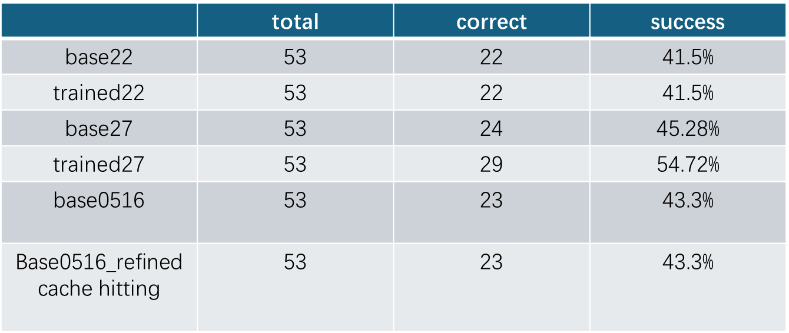
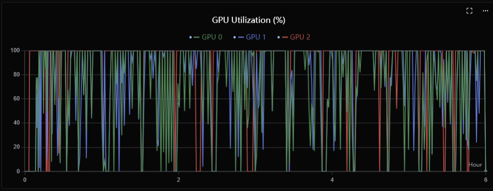
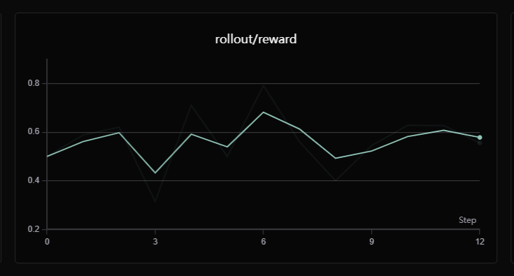

# Context Managers and Compactors

## 1. `manager_idm` + `work_memory_compactor`

**Purpose:** Iterative research agent that uses a DAG (Directed Acyclic Graph) and working memory to track subtask progress.

**How it works:**
- The manager (`ContextManagerIDM`) builds context by parsing the last assistant message for `<DAG>`, `<working_memory>`, and tool calls. It runs a **look-backward** mini-loop (up to 5 iterations) to gather historical info into working memory, and marks DAG nodes as "failed" if they exceed 5 tool-call rounds without being solved.
- The compactor (`WorkMemoryCompactor`) compresses tool results **in parallel** when they exceed 5000 characters. It passes DAG/working memory as context so compression preserves relevant info.
- Has a **training mode** that computes token-level KL divergence rewards (student log-prob vs teacher log-prob) for RL training.

**Key flow:** `manager.build()` → `prepare_context_messages()` → parses DAG/WM/tool calls → calls `compactor.compress_tool_results_parallel()` → assembles structured context.

---

## 2. `manager_auto` + `llm_compactor`

**Purpose:** General-purpose context manager that tags messages with turn identifiers and triggers LLM-based compaction when the token budget overflows.

**How it works:**
- The manager (`ContextManagerAuto`) tags each assistant message as `[Assistant Response, id=AR{ttt}]` and each tool result as `[Environment Response, id=ER{ttt}]`, building a `llm_tag_to_index` mapping from tag → DB message ID.
- On token overflow, the compactor (`LLMCompactor`) sends **all messages + an annotation prompt** to an LLM, which returns per-message decisions: `keep`, `remove`, or `compress`. Then it processes those decisions concurrently, persists deletions/compressions to the DB, and rebuilds the message list.

**Key flow:** `manager.build()` → tags messages with AR/ER IDs → detects overflow → calls `compactor.compact(llm_tag_to_index)` → LLM annotates each message → deletions and compressions persisted → rebuilt context returned.

---

## 3. `manager_tpfc` + `tpfc_compactor`

**Purpose:** Task Planning + Function Calling agent loop that alternates between planning (TP) and execution (FC) phases.

**How it works:**
- The manager (`ContextManagerTPFC`) determines the current phase from `context_type` metadata on messages. It routes to one of three builders:
  - **`_build_fc_context()`**: TP → FC transition. Extracts the current `<subtask>` from the last assistant message, builds an FC-focused prompt, and overrides the model to `qwen3.5-397b-a17b`.
  - **`_build_tp_context()`**: FC → TP transition. Extracts the tool result and function call name, calls the compactor, integrates the compressed `<observation>` into context.
- The compactor (`TPFCCompactor`) picks a summarization strategy based on the function call name: **`summary_web_page()`** for scraping calls (extracts rationale/evidence/summary JSON), **`summary_response()`** for everything else (extracts facts + resources). Both retry up to 3 times on parse failure.

**Key flow:** `manager.build()` → determines `context_type` → if FC→TP: calls `compactor.compact(user_query, sub_task, fc_name)` → chooses scraper or general summarizer → persists compressed content → assembles TP context with `<observation>`.

---

## Comparison

| Pair | Trigger | Compression Strategy | Context Passed |
|---|---|---|---|
| IDM + WorkMemory | After every assistant turn (tool results > 5k chars) | Parallel LLM summarization | DAG, working memory, last tool calls |
| Auto + LLM | Token budget overflow | LLM annotates every message (keep/remove/compress) | `llm_tag_to_index` (AR/ER → DB ID map) |
| TPFC + TPFC | FC→TP phase transition | Route-based: web scraper vs general summarizer | `user_query`, `sub_task`, `fc_name` |

##  Improved tpfc acc on gaia level 1


# AReaL–LeAgent Bridging Architecture

## Design Goal

Fully decouple the **AReaL training engine** (distributed RL on GPU clusters) from the
**LeAgent system** (agent execution platform with its own web server and database). The
two systems communicate exclusively through two channels: a shared **Supabase database**
and the **LeAgent REST API**. Neither system imports or depends on the other's internal
modules.

## Architecture Diagram

```
┌─────────────────────────────────┐      ┌──────────────────────────────┐
│       AReaL Training Engine     │      │       LeAgent System         │
│                                 │      │                              │
│  RolloutWorkflow                │      │  POST /api/agent/start       │
│    └─► TPFCAgent.run() ────────┼─HTTP─►│  GET /api/tasks/{id}/stream  │
│          │                      │      │                              │
│          ▼                      │      │  Agent executor              │
│       run_backend() ◄───────────┼─SSE──┤  (runs in sandbox)          │
│          │                      │      │                              │
│          ├─ DBConnection        │      │                              │
│          ├─ AgentService   ─────┼──┬───┤  ┌──────────────────────┐    │
│          ├─ create_task()  ─────┼──┤   │  │   Supabase Database  │    │
│          ├─ get_llm_messages() ─┼──┼───┼──►  (shared state)      │    │
│          └─ cleanup_sandbox() ──┼──┘   │  │                      │    │
│                                 │      │  │  agents / agent_versions  │
│  compute_reward()               │      │  │  tasks / messages         │
│                                 │      │  │  agent_runs / sandboxes   │
└─────────────────────────────────┘      │  └──────────────────────┘    │
                                         └──────────────────────────────┘
```

## Component Map

### 1. `TPFCAgent` — Training-Side Entry Point

**File:** `customized_areal/tpfc/tpfc_agent.py`

A class-based wrapper that AReaL's `OpenAIProxyWorkflow` calls during rollout. It is the
**only code that the training engine knows about**.

- `__init__()` accepts `user_id`, `train_id`, `trial_name`, `model_name`, and judge
  credentials — all optional, all from workflow config.
- `run(data, **extra_kwargs)` conforms to the workflow agent contract:
  - `data` carries the dataset fields (`query`, `answer`, `files_path`, `query_id`).
  - `extra_kwargs` carries AReaL's proxy routing parameters (`base_url`, `api_key`),
    which are forwarded so the agent's LLM calls go through AReaL's proxy for
    token-level reward tracking.
- After `run_backend()` returns the conversation messages, calls `compute_reward()`
  to produce the RL reward signal.

### 2. `run_backend()` — Bridge Orchestrator

**File:** `customized_areal/tpfc/backend_run.py`

The central orchestration function. A single call performs the full lifecycle:

| Step | Mechanism | Purpose |
|------|-----------|---------|
| 1. DB connect | `DBConnection` singleton → Supabase async client | Shared state access |
| 2. Agent resolution | `AgentService.create_agent()` or `AgentLoader.load_agent()` | Ensure an agent config exists in LeAgent's DB |
| 3. Task creation | `create_task()` → `tasks` table | Register the training episode as a LeAgent task |
| 4. Auth | `SharedTokenManager.get_valid_token()` | Obtain a valid Supabase JWT for API calls |
| 5. Agent start | `POST /api/agent/start` (multipart form) | Trigger LeAgent to begin execution |
| 6. Wait for completion | **Primary:** SSE stream (`/api/tasks/{id}/stream`) with exponential-backoff reconnect. **Fallback:** DB polling on `agent_runs.status` / `tasks.status`. | Reliable completion detection |
| 7. Result retrieval | `get_llm_messages()` → `messages` table | Fetch the full conversation |
| 8. Answer extraction | Regex `<answer>...</answer>` from last assistant message | Structured output parsing |
| 9. Cleanup | `cleanup_sandbox_for_task()` in `finally` | Guaranteed Daytona sandbox deletion |

### 3. `SharedTokenManager` — Multi-Process Auth

**File:** `customized_areal/tpfc/backend_run.py` (lines 97–241)

When AReaL runs multiple rollout workers (one per GPU), each process needs a valid JWT
to call the LeAgent API. Instead of each process refreshing independently (which would
invalidate the refresh token after first use), they share a token file:

- **Shared token file** (`.shared_auth_token.json`) — written atomically via `os.replace`.
- **Refresh-in-progress lock** (`.refresh.lock`) — `fcntl.LOCK_EX | LOCK_NB` so only one
  process refreshes; others wait and re-read.
- **Intra-process serialization** — `asyncio.Lock` prevents concurrent refresh within
  the same process.
- **Fallback login** — if the refresh token itself is expired, falls back to
  email/password Supabase auth.

### 4. `db_service/` — Database Abstraction Layer

**Directory:** `customized_areal/db_service/`

A self-contained package wrapping Supabase operations. No dependency on AReaL core.

| Module | Responsibility |
|--------|---------------|
| `connection.py` | Thread-safe singleton `DBConnection` (async) and `SyncDBConnection` (sync). Reads `SUPABASE_URL` + key from env. |
| `agent_service.py` | Full CRUD for the `agents` table plus version management (`agent_versions`). |
| `agent_loader.py` | Reads agent config from DB. Supports single-load, batch-load, template-load, and metadata-based agent ID resolution. |
| `tasks.py` | `create_task()` writes a pending task record; `update_task_status()` tracks lifecycle. |
| `messages.py` | `get_llm_messages()` with paginated reads and multi-format parsing (JSON string, JSONB dict, compressed content). |
| `sandbox.py` | `cleanup_sandbox_for_task()` looks up the sandbox_id from the `sandboxes` table and calls the Daytona API to delete it. |
| `schemas.py` | Pydantic models: `AgentCreateRequest`, `AgentResponse`, `AgentConfig`, etc. |
| `pagination.py` | Generic cursor/offset pagination for list queries. |

## Data Flow (End-to-End)

```
Dataset row {query, answer, files_path}
  │
  ▼
TPFCAgent.run(data, base_url=..., api_key=...)
  │
  ▼
run_backend(task_description, task_file_path, gt, model_name, base_url, api_key)
  │
  ├─ DB: INSERT INTO tasks (task_id, status='pending')
  ├─ DB: SELECT/INSERT agents, agent_versions
  ├─ Auth: SharedTokenManager → valid JWT
  │
  ├─ HTTP POST /api/agent/start
  │    form: {task_id, prompt, agent_id, model_name, proxy_base_url, proxy_api_key}
  │    → LeAgent creates agent_run, spawns sandbox, agent begins executing
  │
  ├─ HTTP SSE GET /api/tasks/{task_id}/stream
  │    → streams task_end / error events
  │    → auto-reconnect on disconnect
  │
  ├─ (fallback) DB: SELECT status FROM agent_runs WHERE id=...
  │
  ├─ DB: SELECT * FROM messages WHERE task_id=... ORDER BY created_at
  │
  └─ Daytona API: DELETE sandbox/{sandbox_id}
  │
  ▼
compute_reward(ground_truth, user_query, answer) → float
```

## Key Design Decisions

1. **Agent LLM calls route through AReaL's proxy.** `base_url` and `api_key` from
   `extra_kwargs` are passed as `proxy_base_url` / `proxy_api_key` in the agent start
   form. The LeAgent executor uses these to redirect all model calls, enabling
   token-level logging for RL credit assignment.

2. **SSE + DB dual-path completion monitoring.** SSE gives low-latency event delivery;
   DB polling is the reliability fallback if the stream endpoint is unreachable or the
   connection drops permanently.

3. **Agent auto-provisioning.** If no `agent_id` is configured, `run_backend` creates
   one from `TPFC_CONFIG` (system prompt, model, tools). The training system never
   needs pre-seeded agent records.

4. **File-based token sharing across processes.** Avoids the "single-use refresh token"
   problem in multi-worker deployments without a distributed cache.

5. **Guaranteed resource cleanup.** `cleanup_sandbox_for_task()` is in a `finally`
   block, so sandboxes are deleted on normal exit, exception, or `CancelledError`.

6. **Zero code dependency between systems.** `db_service/` and `backend_run.py` only
   import from `httpx`, `supabase`, and `daytona` (all standard LeAgent dependencies).
   AReaL core is only touched for its `getLogger` utility (with import fallback).


# Tree Search Training System

## Design Philosophy: Decoupled Training and Inference

The tree search training system follows the same decoupling principle as the LeAgent
bridge: **training logic lives entirely in the workflow layer**, not in the engine or
trainer core. AReaL's `PPOTrainer` and `FSDPEngine` are unaware of tree search, caching,
or distillation — they only see standard batched tensor dicts with optional
`position_rewards` and loss weights.

```
┌──────────────────────────────────────────────────────────────────┐
│                    AReaL Core (unchanged)                        │
│                                                                  │
│  PPOTrainer.train()                                              │
│   └─ for each batch:                                             │
│        ├─ RolloutWorkflow.arun_episode() → tensor dict           │
│        ├─ Engine.forward_backward_batch() → loss                 │
│        └─ optimizer.step()                                       │
│                                                                  │
│  FSDPEngine / MegatronEngine                                     │
│   └─ Standard forward/backward, logprob gathering                │
└──────────────────────────┬───────────────────────────────────────┘
                           │
          ┌────────────────┴────────────────┐
          ▼                                 ▼
┌──────────────────────┐    ┌──────────────────────────────┐
│  CacheAwarePPOTrainer│    │  TreeSearchGroupedRollout    │
│  (minimal subclass)  │    │  Workflow (all logic here)   │
│                      │    │                              │
│  Only overrides:     │    │  • Cache lookup & reuse      │
│  • _create_train_    │    │  • Tree store ops            │
│    _engine()         │    │  • Advantage computation     │
│  • train() — patches │    │  • Teacher distillation      │
│    distill loss      │    │  • Checkpoint persistence    │
└──────────────────────┘    └──────────────────────────────┘
```

**Key insight**: The rollout workflow is a pure function `(engine, data) → tensor_dict`.
AReaL's trainer consumes tensor dicts, not rollout internals. By wrapping the base
workflow with caching and tree logic, we inject tree search without touching the training
loop, optimizer, or engine forward/backward. The trainer subclass (`CacheAwarePPOTrainer`)
is ~30 lines and only patches the loss function when distillation is enabled.

##  Decoupled Training and Inference for different GPU




## Compact Implementation: Minimal Modification Surface

All tree-search code lives under `customized_areal/tree_search/`. The only changes to
AReaL core are:

| Change | Location | Purpose |
|--------|----------|---------|
| Workflow `group_size` config | `areal/api/cli_args.py` | Number of rollouts per query for tree search |
| `version` metadata forwarding | `areal/utils/logging.py` | Track policy version per token in rollout logs |
| `multi_candidate` flag | `areal/trainer/rl_trainer.py` | Signal multi-candidate logprob gathering |

Everything else — tree store, advantage computer, checkpoint manager, teacher client,
distillation pipeline — is self-contained in `customized_areal/tree_search/`. The
architecture leverages AReaL's existing extension points:

- **`RolloutWorkflow.arun_episode()`** — the natural boundary. Tree logic wraps this.
- **`PPOTrainer._create_train_engine()`** — swap in `MultiCandidateFSDPPPOActor` when
  distillation is enabled.
- **`PPOTrainer.train()`** — patch the loss function before the training loop.

No engine code, no optimizer code, no distributed communication code was modified.

## Component Architecture

### 1. Tree Store (`mcts_tree_store.py`) — Flat Per-Query Storage

Replaces the original trie-based structure with a **flat list of `Node` objects per
query**, grouped by `episode_id`. This design choice matters because:

- **Full conversation context is preserved.** Each `Node` stores the complete token
  sequence from conversation start through the current turn. The trie approach only kept
  assistant-marker tokens as prompt context, discarding system prompts, user messages,
  and multi-turn history.
- **Turn boundaries are derived from `loss_mask`**, not tokenizer-specific markers.
  This is tokenizer-agnostic and handles arbitrary conversation structures.
- **Node identity is stable.** `node_id` comes from the inference engine (UUID string),
  so checkpoint persistence and cache lookup don't need to rebuild indices.

```
MCTSTreeStore
├── _trajectories: dict[query_id, list[Node]]
├── _visit_counts: dict[node_id, int]        ← MCTS statistics
├── _total_values: dict[node_id, float]
├── _q_values: dict[node_id, float]
└── _normalized: dict[node_id, dict]         ← GRPO-normalized advantages/returns
```

Each `Node` is a dataclass (~20 fields) that carries everything the advantage computer
and distillation pipeline need — no separate metadata store, no cross-referencing.

### 2. Cache Reuse — Episode-Level Partial Regeneration

The cache operates at **episode granularity** within each query:

```python
cached_count = tree_store.get_untrained_episode_count(query_id)
need_gen = max(0, group_size - cached_count)
```

For a query with `group_size=8` and 5 cached untrained episodes, only 3 fresh rollouts
are generated. The 5 cached episodes are loaded from the store and their `versions` are
reset to `0` on response tokens so **decoupled PPO treats them as current-policy
rollouts** — the trust-region clipping still applies correctly because the advantage
recomputation uses the current value function.

Cache modes (`CacheMode`):
- **`OFF`** — standard training, no caching
- **`IN_TRAINING`** — cache within a single training run (tree lives in memory)
- **`CROSS_TRAINING`** — persist tree across training runs via JSON checkpoints

### 3. Advantage Computation — Per-Query GRPO Normalization

`TreeAdvantageComputer` replaces GAE with **per-query normalized Q-values**:

1. Group all nodes by `query_id`
2. For each query group, normalize `outcome_reward` to zero-mean unit-variance
3. For each node, compute `advantages = normalized_Q × loss_mask` (value on response
   tokens, 0 on prompt tokens)
4. Set `node.advantages` and `node.returns` in-place

This is mathematically equivalent to GRPO's group-level advantage normalization but
operates on tree-structured trajectories. Each trajectory gets a single scalar Q-value
(mean reward with visit count = 1 in the current implementation — straightforward to
extend to true MCTS backups with multiple visits).

### 4. Teacher Distillation — Selected-Turn Supervision

When `loss_mode` is `DISTILL` or `BOTH`, the workflow adds a **diagnosis → teacher
logprob → position reward** pipeline:

```
Episode Nodes
     │
     ▼
diagnose_episode(context, ground_truth)
     │  LLM analyzes conversation, selects turns needing improvement
     ▼
selected_turns: dict[turn_idx → guidance_text]
     │
     ▼
selected_turn_to_position_rewards(node, guidance)
     │  Teacher model computes logprobs for candidate tokens
     ▼
PositionRewardInfo(candidate_token_ids, teacher_logprobs, rewards)
     │
     ▼
Attached to result_dict["position_rewards"]
     │
     ▼
MultiCandidateFSDPEngine computes student logprobs for all candidates
     │
     ▼
grpo_distill_loss = rl_weight × GRPO_loss + distill_weight × KL(student || teacher)
```

Key design decisions:
- **Diagnosis and teacher are separate concerns.** The diagnosis model identifies *which
  positions* need improvement. The teacher model provides *what the correct logprobs are*.
  They can be the same model or different models.
- **Teacher provider abstraction** (`EngineTeacherProvider` vs `ExternalTeacherProvider`):
  the teacher can be the training engine itself (on-policy) or an external API (off-policy
  frozen teacher).
- **Per-position granularity**: distillation happens at the token-position level, not the
  trajectory level, enabling fine-grained supervision.
- **`DISTILL` mode drops episodes** that have no diagnosed turns — no supervision signal
  means no training benefit.
- **Distillation never blocks training.** The diagnosis and teacher logprob calls are
  wrapped in `_prepare_distill_for_node_groups()` with per-episode `try/except`. If the
  teacher API is unavailable, diagnosis parsing fails, or any individual episode errors
  out, that episode is either kept with GRPO-only supervision (`BOTH` mode) or dropped
  (`DISTILL` mode) via `_filter_distill_episode_failure()`. The training step proceeds
  with whatever episodes succeeded — there is no all-or-nothing coupling between
  distillation availability and training throughput.

### 5. Tree Attention (Trie Packing) — Independent Efficiency Layer

The `areal/models/tree_attn/` module is **conceptually independent** of the MCTS tree
but used during training for efficiency. When multiple episodes for the same query share
conversation prefixes (same system prompt, same initial turns), they are packed into a
trie:

```
Episode A: [sys, q1, turn1_a, turn2_a]
Episode B: [sys, q1, turn1_b]              →  TrieNode: sys → q1 → {turn1_a → turn2_a,
Episode C: [sys, q1, turn1_c, turn2_c]                              turn1_b,
                                                                    turn1_c → turn2_c}
```

Shared prefix tokens are computed once in the forward pass, and the attention mask
restricts each token to its ancestral path. This gives O(shared_prefix) savings in both
compute and memory for the forward pass, at the cost of a more complex attention kernel
(Triton or PyTorch Flex Attention).

## Data Flow Summary

```
Dataset query
     │
     ▼
TreeSearchGroupedRolloutWorkflow.arun_episode()
     │
     ├─ Cache check → partial regeneration
     ├─ Fresh rollouts → _result_to_nodes()
     ├─ Cached nodes  → load_untrained_episodes()
     ├─ Distillation (separate fresh/cached passes)
     ├─ Combine → insert → compute advantages → mark trained
     └─ Return batched tensor dict {input_ids, logprobs, advantages,
                                     position_rewards, distill_loss_weight, ...}
     │
     ▼
MultiCandidateFSDPEngine.forward_backward_batch()
     │
     ├─ build_packed_tree_batch() → TrieNode
     ├─ forward() + tree attention
     ├─ logprobs for chosen tokens + all candidate tokens
     └─ grpo_distill_loss_fn() → combined loss
     │
     ▼
PPOTrainer → optimizer.step()
```

## Comparison: Standard PPO vs Tree Search PPO

| Aspect | Standard PPO (AReaL) | Tree Search PPO |
|--------|---------------------|-----------------|
| Rollout per query | 1 episode | `group_size` episodes |
| Advantage | GAE over single trajectory | Per-query normalized Q-values over group |
| Cache | None | Episode-level reuse across training steps |
| Cross-run persistence | None | JSON checkpoint (CROSS_TRAINING mode) |
| Loss | GRPO only | GRPO + teacher KL distillation |
| Engine | Standard FSDPEngine | MultiCandidateFSDPEngine (multi-token logprobs) |
| Attention | Standard causal | Tree attention (trie-packing shared prefixes) |
| Code changes to AReaL | 0 | ~3 files (~50 lines total) |


# Conbined MCTS Tree Backup for PPO Training and teacher guilded on-policy distilling

This module replaces GAE advantage computation with MCTS tree backup Q-values, enabling
rollout caching across training steps. It also supports on-policy distillation with a
teacher model. It is a customization layer on top of AReaL's `PPOTrainer`.

## Training flow

```
┌──────────────────────────────────────────────────────────────────────────┐
│                    CacheAwarePPOTrainer.train()                          │
│                                                                          │
│  If loss_mode != GRPO:                                                   │
│   ├─ patch_ppo_actor_class_to_use_distill_loss()                         │
│   ├─ super().train()  (standard training loop)                           │
│   └─ unpatch_ppo_actor_distill_loss()  (in finally)                      │
│  Otherwise:                                                              │
│   └─ super().train()  (standard training loop)                           │
└─────────────────────────────────┬────────────────────────────────────────┘
                                  │
                                  │  per training step
                                  ▼
┌──────────────────────────────────────────────────────────────────────────┐
│  TreeSearchGroupedRolloutWorkflow.arun_episode()                         │
│                                                                          │
│  1. CHECK CACHE                                                          │
│     ├─ query_id = data.get("query_id", "")                               │
│     ├─ cached_count = tree_store.get_untrained_episode_count(query_id)   │
│     └─ need_gen = max(0, group_size - cached_count)                      │
│                                                                          │
│  2. GENERATE FRESH EPISODES (if need_gen > 0)                            │
│     ├─ Run need_gen parallel rollouts via asyncio.gather                 │
│     ├─ Retry failed episodes via _retry_episode()                        │
│     └─ Convert results to Nodes via _result_to_nodes()                   │
│                                                                          │
│  3. LOAD CACHED NODES (if cached_count > 0)                              │
│     ├─ tree_store.load_untrained_episodes(query_id, cached_count)        │
│     └─ Reset versions to 0 on response tokens (decoupled PPO)            │
│                                                                          │
│  4. DISTILLATION (if loss_mode != GRPO)                                  │
│     ├─ Get teacher provider (external API or engine)                     │
│     ├─ Diagnose episodes to find turns needing improvement               │
│     ├─ Get teacher logprobs for selected turns                           │
│     ├─ Build PositionRewardInfo with candidate tokens + teacher logprobs │
│     └─ Applied separately to fresh and cached node groups                │
│                                                                          │
│  5. COMBINE fresh_nodes + cached_nodes                                   │
│                                                                          │
│  6. TREE OPERATIONS                                                      │
│     ├─ tree_store.insert_batch(fresh_nodes)                              │
│     ├─ tree_advantage_computer.compute(all_nodes)  (TREE mode)           │
│     ├─ Mark all nodes as trained via tree_store.set_trained()            │
│     └─ Save checkpoint (CROSS_TRAINING mode)                             │
│                                                                          │
│  7. CONVERT TO TENSOR DICT                                               │
│     ├─ _nodes_to_batched_tensor_dict(all_nodes)                          │
│     └─ Inject distill weights and position_rewards if loss_mode != GRPO  │
│                                                                          │
│  Return: dict[str, torch.Tensor]  (batched tensor dict)                  │
└──────────────────────────────────────────────────────────────────────────┘
                                  │
                                  ▼
┌──────────────────────────────────────────────────────────────────────────┐
│  Training Engine (MultiCandidateFSDPEngine)                              │
│                                                                          │
│  ├─ build_packed_tree_batch() → packs sequences into trie                │
│  ├─ forward() with tree attention (TrieNode → tree_block_mask)           │
│  ├─ _compute_logprobs_entropy() → multi-candidate logprobs               │
│  ├─ ppo_update() with grpo_distill_loss_fn()                             │
│  │   ├─ Standard GRPO loss (chosen token)                                │
│  │   └─ Teacher KL loss (all candidates)                                 │
│  └─ Standard logging and checkpointing                                   │
└──────────────────────────────────────────────────────────────────────────┘
```
## improving reward in training in GRPO training


